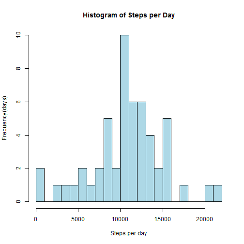
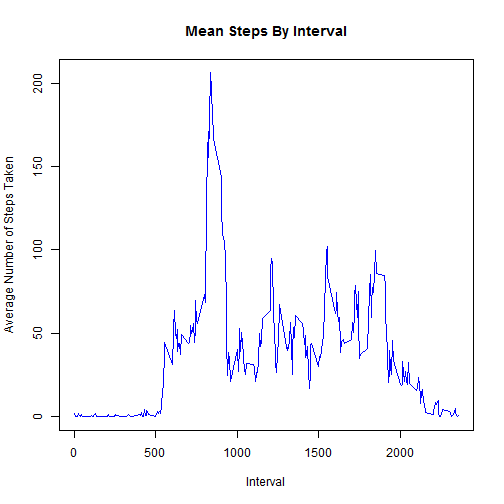
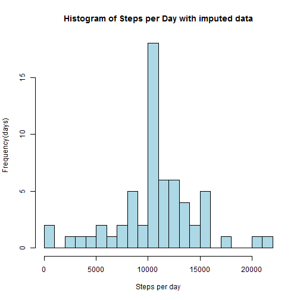
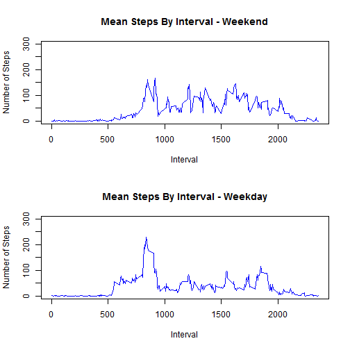

# Reproducible Research: Peer Assessment 1
Assumption - The unzipped data is in your working directory.  

## 1. Loading and preprocessing the data
### 1.1 Load the data  
We first load the data using data.table (its fast! its fun!) into a variable and look at its summary.


```r
library(data.table)
data <- fread("./activity.csv")
head(data)
```

```
##    steps       date interval
## 1:    NA 2012-10-01        0
## 2:    NA 2012-10-01        5
## 3:    NA 2012-10-01       10
## 4:    NA 2012-10-01       15
## 5:    NA 2012-10-01       20
## 6:    NA 2012-10-01       25
```
  
### 1.2 Process/transform the data (if necessary) into a format suitable for your analysis  
We change the date to a date format from a character.

```r
data$date <- as.Date(data$date,format = "%Y-%m-%d")
```


## 2. What is mean total number of steps taken per day?
  
The `activity$steps` column contains the steps taken in 5-minute intervals for each day. We group the `activity$steps` by `activity$date` and thus create our new frame ignoring the NA values.


```r
dailysteps <- data[!is.na(steps), sum(steps), by = date]
```

### 2.1 Make a histogram of the total number of steps taken each day  
We now make the histogram from the variable above.

```r
hist(dailysteps$V1,
     main = "Histogram of Steps per Day",
     breaks=20,xlab = "Steps per day",
     ylab="Frequency(days)", col="lightblue")
```

 
   
### 2.2 Calculate and report the mean and median total number of steps taken per day

```r
meanofsteps <- mean(dailysteps$V1, na.rm=TRUE)
medianofsteps <- median(dailysteps$V1, na.rm=TRUE)
```
  
Mean steps per day: **10766.19**

Median steps per day: **10765**  

## 3. What is the average daily activity pattern?

### 3.1 Make a time series plot of the 5-minute interval and the average number of steps taken, averaged across all days

We reorganize the data into a new format to organize steps by interval.

```r
stepsbyinterval <- data[!is.na(steps), mean(steps), by = interval]
```

And then we make the time series plot.

```r
plot(x = stepsbyinterval$interval, y = stepsbyinterval$V1, ##This is mean steps
      type = "l",
      col = "blue",
      main = "Mean Steps By Interval",
      xlab = "Interval",
      ylab = "Average Number of Steps Taken")
```

 
  
### 3.2 Which 5-minute interval, on average across all the days in the dataset, contains the maximum number of steps?

To calculate this, we call the max function on our dataset made above.

```r
maxnosteps <- stepsbyinterval[V1 == max(stepsbyinterval$V1), interval]
```

Thus the interval 835 has the maximum number of steps on average across all the days in the dataset.
  
## 4. Imputing missing values
  
### 4.1 Calculate and report the total number of missing values in the dataset
  
We do this by adding the output of is.na functionc called on our data.

```r
countna <- sum(is.na(data$steps))
```

The total number of missing values in the dataset are **2304**

### 4.2 Devise a strategy for filling in all of the missing values in the dataset
My strategy for filling in all the missing values is substituting them with the **average/mean** of ***each interval***.

### 4.3 Create a new dataset that is equal to the original dataset but with the missing data filled in.
To do this first we copy the original dataset into a new variable.

```r
filledData <- copy(data)
```

Now we check to see if the values are NA, if so, we replace them with the mean of each interval. This is done by a combination of the "by" feature of data.table along with the the special refence .SD which allows us access to the sub table.

```r
filledData[,steps := ifelse(is.na(steps),
                            as.integer(mean(.SD$steps, na.rm = TRUE)),
                            steps), by = interval]
```

```
##        steps       date interval
##     1:     1 2012-10-01        0
##     2:     0 2012-10-01        5
##     3:     0 2012-10-01       10
##     4:     0 2012-10-01       15
##     5:     0 2012-10-01       20
##    ---                          
## 17564:     4 2012-11-30     2335
## 17565:     3 2012-11-30     2340
## 17566:     0 2012-11-30     2345
## 17567:     0 2012-11-30     2350
## 17568:     1 2012-11-30     2355
```
### 4.4.1 Make a histogram of the total number of steps taken each day

We make the histogram as we made before but with our new data table.

```r
filleddailysteps <- filledData[, sum(steps), by = date]
hist(filleddailysteps$V1,
     main = "Histogram of Steps per Day with imputed data",
     breaks=20,xlab = "Steps per day",
     ylab="Frequency(days)", col="lightblue")
```

 

### 4.4.2 Calculate and report the mean and median total number of steps taken per day
We calculate the mean and median on imputed data.

```r
meanofstepsimp <- mean(filleddailysteps$V1)
medianofstepsimp <- median(filleddailysteps$V1)
```
Thus with the imputed data we have **mean** = **10749.77** and **median** = **10641**

### 4.4.3 Do these values differ from the estimates from the first part of the assignment?
Yes these values differ from the original mean (10766.19) and median (10765)  
**Difference (Imputed vs Original)**  
Difference in Mean = -16.4182  
Difference in Median = -124  

### 4.4.4 What is the impact of imputing missing data on the estimates of the total daily number of steps?
The impact of imputing missing data is minimal. The mean and median do decrease but only by a small value.
  
## 5.Are there differences in activity patterns between weekdays and weekends?
To calculate this, we need to create a factor variable specifying weedays and weekends. We do this by using the "weekdays" function.
### 5.1 Create a new factor variable in the dataset with two levels - "weekday" and "weekend" indicating whether a given date is a weekday or weekend day

```r
filledData[, type := as.factor(
                        ifelse( (weekdays(date) == "Saturday") | 
                                (weekdays(date) == "Sunday"),
                              "Weekend", 
                              "Weekday"))]
```

```
##        steps       date interval    type
##     1:     1 2012-10-01        0 Weekday
##     2:     0 2012-10-01        5 Weekday
##     3:     0 2012-10-01       10 Weekday
##     4:     0 2012-10-01       15 Weekday
##     5:     0 2012-10-01       20 Weekday
##    ---                                  
## 17564:     4 2012-11-30     2335 Weekday
## 17565:     3 2012-11-30     2340 Weekday
## 17566:     0 2012-11-30     2345 Weekday
## 17567:     0 2012-11-30     2350 Weekday
## 17568:     1 2012-11-30     2355 Weekday
```

After we have the factor variables we just need to create the step series sorted by the day type.

```r
stepsbytypeofday = filledData[, mean(.SD$steps), by = c("interval", "type")]
head(stepsbytypeofday)
```

```
##    interval    type      V1
## 1:        0 Weekday 2.15556
## 2:        5 Weekday 0.40000
## 3:       10 Weekday 0.15556
## 4:       15 Weekday 0.17778
## 5:       20 Weekday 0.08889
## 6:       25 Weekday 1.57778
```
### 5.2 Make a panel plot containing a time series plot of the 5-minute interval (x-axis) and the average number of steps taken, averaged across all weekday days or weekend days (y-axis)

```r
par(mfrow = c(2,1))
plot(x = stepsbytypeofday[type == "Weekend",interval],
     y = stepsbytypeofday[type == "Weekend",V1],
     type = "l",
      col = "blue",
      main = "Mean Steps By Interval - Weekend",
      xlab = "Interval",
      ylab = "Number of Steps",
     ylim = c(0,300))
plot(x = stepsbytypeofday[type == "Weekday",interval],
     y = stepsbytypeofday[type == "Weekday",V1],
     type = "l",
      col = "blue",
      main = "Mean Steps By Interval - Weekday",
      xlab = "Interval",
      ylab = "Number of Steps",
     ylim = c(0,300))
```

 
